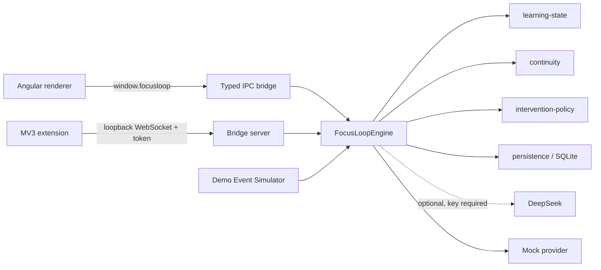

# FocusLoop

**A local-first learning-continuity agent for people who find attention and task initiation hard.**

FocusLoop does **not** diagnose ADHD and does not model clinical severity. It observes the
_learning interaction_ — has the learner started, are they still here, where were they thinking —
and helps them get back to the exact cognitive position they left.

> v0.1 demo · Electron + Angular desktop · MV3 browser bridge · everything stays on your machine.

---

## Quick start

**Prerequisites:** [Node.js](https://nodejs.org) ≥ 22.13 (`.nvmrc` pins the exact version) and
pnpm ≥ 9.

```bash
corepack enable   # provides pnpm at the version pinned in package.json
pnpm install
```

If `corepack` is unavailable, `npm install -g pnpm` works too.

### Run the desktop app

```bash
pnpm --filter @focusloop/desktop run start
```

That compiles the Angular renderer and the Electron main process, then opens the window. There is
no hot reload — after changing source, stop the app and run the command again.

Because you are running from source, the **Demo Event Simulator** appears along the bottom of the
window whenever a focus session is active. It is the supported stand-in for the browser extension,
so the whole demo works without installing anything else.

### Start it without typing the command

`scripts\start-focusloop.cmd` does the same thing as the command above. Double-click it, or run it
from any directory — it always works from the repository root. If something fails it keeps the
window open so the error is readable.

### Start it at login (Windows)

`scripts\focusloop-startup.ps1` puts a shortcut in your personal Startup folder, so FocusLoop opens
when you sign in to Windows. It needs no administrator rights, it changes nothing until you run it,
and it is undone with one flag:

```powershell
.\scripts\focusloop-startup.ps1            # start FocusLoop at every sign-in
.\scripts\focusloop-startup.ps1 -Remove    # stop doing that
```

By default it auto-starts the development launcher, which rebuilds before opening. To auto-start an
installed copy instead, point it at the executable:

```powershell
.\scripts\focusloop-startup.ps1 -Target "$env:LOCALAPPDATA\Programs\FocusLoop\FocusLoop.exe"
```

### Try it

**Home** → _Start session_ on “Red-black trees: the basics” → _Start_ on the first micro task →
_Complete task_ → simulator **Distraction** → simulator **Return** → the Resume Card appears.

### Run the checks

```bash
pnpm lint        # eslint across every project
pnpm typecheck   # tsc --noEmit across every project
pnpm test        # vitest across every project
pnpm build       # production bundles for every project
pnpm e2e         # playwright drives the real Electron app, building it first
```

`pnpm e2e` builds the desktop app as a dependency before it runs, so it works on a clean checkout.

### Package a release

```bash
pnpm --filter @focusloop/desktop run package      # → apps/desktop/release/FocusLoop-Setup.exe
pnpm --filter @focusloop/extension run build:zip  # → apps/extension/release/focusloop-extension.zip
```

---

## What it does

1. Open the built-in demo course (or import your own `.txt` / `.md` notes).
2. FocusLoop shows 3–5 micro tasks, each a few minutes long.
3. Start a **Focus Session** and work through them.
4. FocusLoop continuously saves a **Learning Checkpoint** — the current concept, the goal, what is
   mastered, what is still unresolved, and the next best action.
5. If you leave the tab or go idle past a threshold, the state engine moves to `INTERRUPTED`.
6. When you come back, a **Resume Card** appears: where you were, what you finished, what is open,
   and the next step — not a notification telling you to "stay focused".
7. Continue, and FocusLoop records the **resume latency** and whether the intervention helped.
8. The **Dashboard** shows duration, task completion, interruptions, average resume latency and
   intervention outcomes.
9. The **Insights** view above it re-aggregates on demand over this session, today, the last seven
   days or all time: total and daily-average time, a ring of time by learning state, a daily
   activity grid and a per-course breakdown.

The interface is bilingual — English and Simplified Chinese — and the theme can follow the operating
system or be pinned to light or dark. Both choices are stored locally and survive a restart.

### Deliberately not in v0.1

Medical diagnosis · always-on camera/eye-tracking/microphone · mobile apps · accounts ·
a central business server · Redis/Postgres/NestJS · collaboration · reinforcement learning.

---

## The demo, in 3 minutes

```text
00:00  Launch FocusLoop
00:15  Open "Red-black trees: the basics"
00:30  See the 5 micro tasks
00:45  Start Focus Session
01:10  Complete the first task
01:30  Simulator: Distraction
01:45  FocusLoop does NOT nag
02:00  Simulator: Return
02:05  Resume Card appears
02:15  "Continue: Recall the ordering invariant" — done / open / next step
02:35  Continue
02:45  Back on the micro task
03:05  Complete it
03:15  Dashboard: interruption count, resume latency, outcomes
```

The **Demo Event Simulator** is a supported product feature, not a test hack: it keeps the golden
path demonstrable without the browser extension installed. It is hidden in packaged builds.

---

## Architecture

```text
focusloop/
├─ apps/
│  ├─ desktop/          Electron main + preload + Angular renderer
│  ├─ desktop-e2e/      Playwright golden-path test (drives the real Electron app)
│  └─ extension/        Chrome/Edge Manifest V3 bridge
├─ packages/
│  ├─ shared-types/     The domain vocabulary. No logic, no dependencies.
│  ├─ learning-state/   Pure, rule-based state engine (8 states, event driven)
│  ├─ continuity/       Checkpoint building, interruption detection, resume engine
│  ├─ intervention-policy/  Rule-based policy v1 + outcome records
│  ├─ material-parser/  .txt / .md → MaterialDocument
│  ├─ agent-core/       Micro-task generation + the application service
│  ├─ persistence/      SQLite schema, migrations and repositories
│  └─ llm-provider/     Provider abstraction, MockAIProvider, optional DeepSeek adapter
└─ tooling/
```



### Four invariants

1. **Local-first.** There is no mandatory server. The whole golden path, including resume and
   dashboard, runs with the network switched off and no API key.
2. **The state engine is a domain model, not a prompt.** `learning-state` is a pure reducer with
   no clock, no IO and no LLM. It is exhaustively unit-tested.
3. **The renderer is isolated.** `contextIsolation: true`, `nodeIntegration: false`,
   `sandbox: true`, and a closed whitelist of IPC channels that re-validate every argument.
4. **Privacy is enforced by the permission model.** The browser extension requests no page access
   at all — it cannot read URLs, titles, page text, form input or cookies.

More detail: [`docs/architecture.md`](docs/architecture.md) · [`docs/privacy.md`](docs/privacy.md)

Agent capability planning: [`docs/wiki/README.md`](docs/wiki/README.md)

---

## Install

Download the latest `FocusLoop-Setup.exe` from the
[releases page](https://github.com/nianpingy-cpu/focusloop/releases) and run it. No Node.js or pnpm
is required on the target machine.

Verify your download against `SHA256SUMS.txt`.

To build it yourself instead, see [Quick start](#quick-start).

---

## Development

[Quick start](#quick-start) covers installation, running the app and packaging.

```bash
pnpm lint        # eslint across every project
pnpm typecheck   # tsc --noEmit across every project
pnpm test        # vitest across every project
pnpm build       # angular + esbuild + extension bundles
pnpm e2e         # playwright drives the real Electron app
```

### Publishing

The project is hosted in a **private** repository:
[`nianpingy-cpu/focusloop`](https://github.com/nianpingy-cpu/focusloop). See
[`docs/publishing.md`](docs/publishing.md) for how the installer is distributed, the commit-identity
caveat, and what a rename would break.

### Optional: a real model provider

The default provider is `MockAIProvider` — deterministic, offline, and enough for the entire demo.
To use a real provider instead, supply a key at runtime:

```bash
FOCUSLOOP_DEEPSEEK_API_KEY=... pnpm --filter @focusloop/desktop run start
```

On PowerShell the same thing is:

```powershell
$env:FOCUSLOOP_DEEPSEEK_API_KEY="..."; pnpm --filter @focusloop/desktop run start
```

Keys are read from the environment only. They are never written to the repository, never persisted
to the database, and never logged. If the provider fails (offline, timeout, rate limit, bad
response) FocusLoop degrades to the mock provider and tells the UI why.

---

## Privacy

- No account, no telemetry, no analytics, no crash reporting.
- The SQLite database lives in the OS user-data directory and is the only stored artefact.
- The browser bridge binds to `127.0.0.1` only, requires a per-run token, and rejects anything that
  is not a strictly validated metadata message.
- Imported material and generated courses are stored locally and never uploaded.

Full statement: [`docs/privacy.md`](docs/privacy.md).

---

## Testing

```bash
pnpm test                                        # every unit test in the workspace
pnpm --filter @focusloop/desktop-e2e run e2e     # the golden path, in the real app
pnpm verify:scaffolding                          # no scaffolding or debug leftovers
pnpm verify:workflows                            # pinned actions, stated permissions, timeouts
pnpm verify:docs                                 # the commands, packages and links the docs cite
pnpm verify:tokens                               # one palette, and the native window background
```

The suite is organised so that the domain is proven independently of the UI:

| Area                  | What is proven                                                              |
| --------------------- | --------------------------------------------------------------------------- |
| `learning-state`      | Every state transition, thresholds, duplicate events, purity, determinism   |
| `continuity`          | Checkpoint content, interruption detection, resume card content, latency    |
| `intervention-policy` | Every rule, `NO_ACTION`, cooldowns, escalation, outcome aggregation         |
| `persistence`         | Migrations, round-trips, dedupe, isolation between sessions, durability     |
| `agent-core`          | The golden path at domain level, plus degraded mode with a failing provider |
| `desktop`             | IPC validation (rejects hostile payloads) and the loopback bridge           |
| `extension`           | Tab/idle tracking and reconnect/duplicate protection                        |
| `desktop-e2e`         | The whole product, launched, clicked and asserted                           |

Details: [`docs/testing.md`](docs/testing.md)

---

## Roadmap

- **v0.1 (this release)** — desktop, learning state, checkpoints, resume, intervention outcomes,
  dashboard, bridge, packaging.
- **v0.2** — PDF import, richer material parsing, per-concept mastery model.
- **v0.3** — user-tunable thresholds, export/import of the local store.
- **Later** — additional provider adapters; optional, explicitly opt-in sync.

---

## Contributing

Read [`CONTRIBUTING.md`](CONTRIBUTING.md). One issue per branch, RED → GREEN → REFACTOR, no direct
pushes to `main`, and an independent review before merge.

## License

MIT — see [`LICENSE`](LICENSE).
