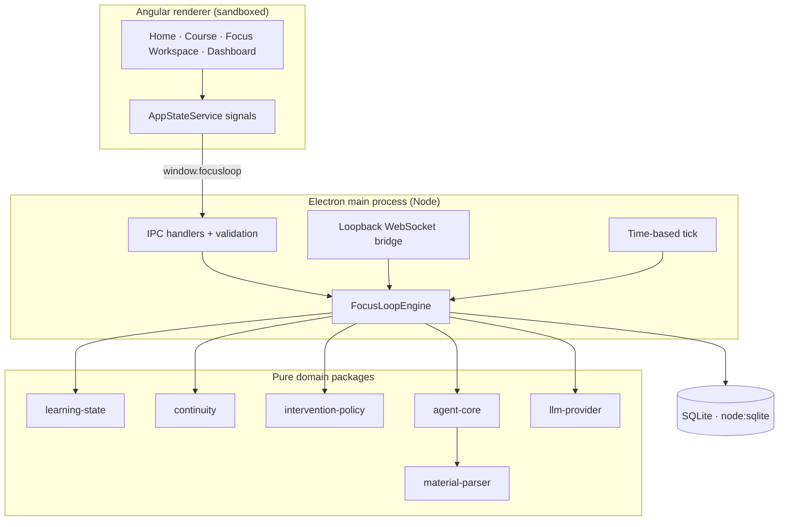
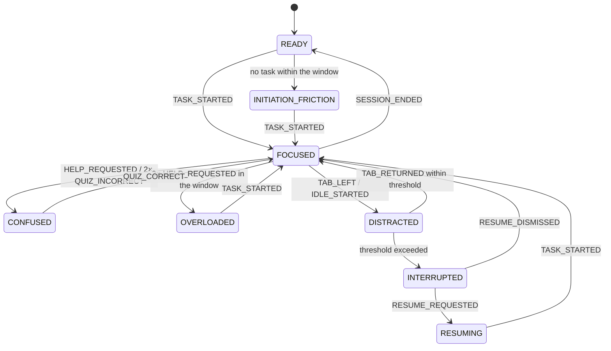
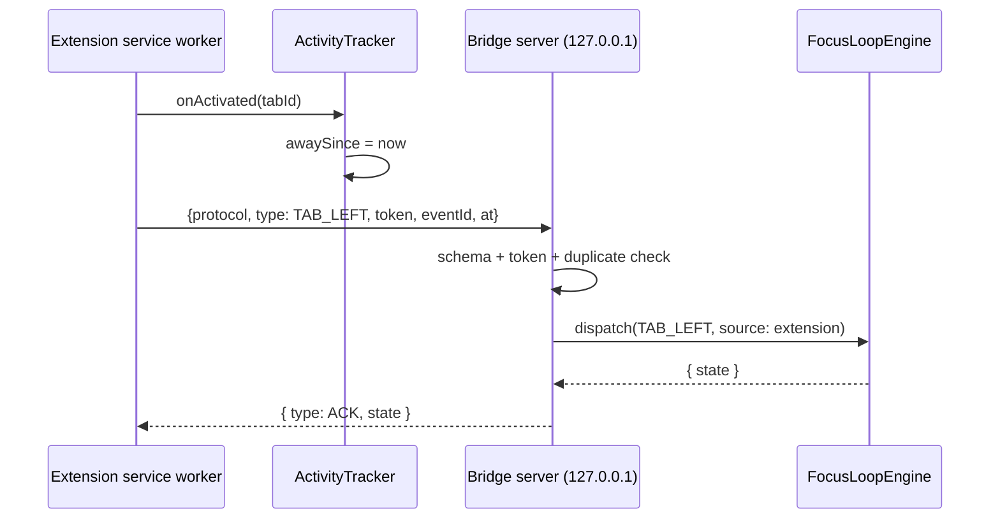

# Architecture

## The shape of the system

FocusLoop is a local-first desktop application. There is no server in v0.1, and the golden path
never needs one.



## Layers, and what may depend on what

| Layer           | Packages                            | May depend on                                     |
| --------------- | ----------------------------------- | ------------------------------------------------- |
| Vocabulary      | `shared-types`                      | nothing                                           |
| Pure domain     | `learning-state`, `material-parser` | `shared-types`                                    |
| Domain services | `continuity`, `intervention-policy` | vocabulary + pure domain                          |
| Application     | `agent-core`                        | everything above + `persistence` + `llm-provider` |
| Infrastructure  | `persistence`, `llm-provider`       | vocabulary                                        |
| Shell           | `apps/desktop`, `apps/extension`    | any package                                       |

Two rules keep this honest:

- **The renderer imports `shared-types` only.** It never imports a domain package, so no decision is
  ever made in the UI.
- **Nothing in `learning-state` or `continuity` imports `persistence`.** Tests construct them with
  plain values.

## Language: the domain emits keys, the renderer owns the wording

FocusLoop ships an English and a Simplified Chinese interface. The rule that makes this work is that
**no domain package ever produces a sentence.**

Instead of returning `"Here is a hint"`, the policy returns a descriptor:

```ts
{ key: 'reason.confused.hint', params: {} }        // LocalizedMessage
{ key: 'reason.confused.example', params: { count: '2' } }
```

`shared-types` closes the vocabulary: `NEXT_ACTION_KEYS`, `RESUME_MESSAGE_KEYS` and
`INTERVENTION_REASON_CODES` are `as const` tuples, and `DomainMessageKey` is their union. Nothing
else can be emitted, so nothing else has to be translated.

Three consequences, and all three are enforced rather than encouraged:

1. **There is one bilingual implementation, not two.** The rule engine never branches on locale.
2. **A missing translation is a compile error.** `messages.en.ts` defines the key set; `messages.zh.ts`
   is typed `Record<MessageKey, string>`, so leaving a key out fails `pnpm typecheck` in CI.
3. **Placeholders cannot silently diverge.** A test compares the `{name}` tokens in both languages,
   because `{minutes}` in English and `{count}` in Chinese would render a visible `{count}` to one
   set of users — a bug the type checker cannot see.

Wording lives in the renderer (`apps/desktop/src/app/core/i18n/`), which is also where the mapping
from closed vocabularies to keys lives (`labels.ts`), so adding a learning state or an intervention
action forces someone to decide how it reads in both languages.

Interpolated values that are _content_ rather than _chrome_ — a concept title, a task title, a
learner's own note — are never translated, because they are the learner's material and not ours.

The locale itself is persisted by the store (`app_meta.locale`), not by the renderer, and the store
is reached through the same validated IPC bridge as everything else (`settings:get`,
`settings:set-locale`). The renderer holds no durable state, so switching language survives a
restart.

## The state engine

`learning-state` is the heart of the project and the reason FocusLoop is an agent rather than a
prompt wrapper.

```ts
type LearningState =
  | 'READY'
  | 'INITIATION_FRICTION'
  | 'FOCUSED'
  | 'CONFUSED'
  | 'OVERLOADED'
  | 'DISTRACTED'
  | 'INTERRUPTED'
  | 'RESUMING';
```



Properties that the tests hold us to:

- **Pure.** `reduceState(previous, event, config)` never mutates, never reads the clock, never does
  IO. The event carries its own timestamp.
- **Deterministic.** The same inputs always produce the same state.
- **Deduplicated.** A bounded ring of recent event ids means a replayed or racing event is ignored.
- **Time-aware without a clock.** `evaluateTimeBasedState(state, now, config)` is a separate pure
  function that the host calls on a tick. That is how "away for 20 seconds" becomes an interruption
  even though no event ever arrives.

## The checkpoint and the resume card

A checkpoint is not "which screen was open". It is the learner's cognitive position:

```ts
interface LearningCheckpoint {
  sessionId;
  conceptId;
  conceptTitle;
  goal;
  mastered: string[];
  unresolved: string[];
  currentTaskId;
  currentTaskTitle;
  currentStep;
  frictionState: LearningState;
  nextBestAction;
  createdAt;
}
```

`continuity` builds it from the session, the course and the engine state — purely, so it can be
constructed in a test with no database. The checkpoint id is derived from
`${sessionId}:${interruptedSince}`, which makes checkpoint creation idempotent: the same
interruption can be processed repeatedly and yields one checkpoint.

The resume card is then a rendering of that checkpoint plus the interruption context:

```ts
interface ResumeCard {
  title;
  lastContext;
  completed: string[];
  unresolved: string[];
  nextAction;
  estimatedMinutes;
}
```

`ResumeCardTiming` records `shownAt`, `acceptedAt`, `dismissedAt` and the derived
`resumeLatencyMs`. That latency is the single most important number in the product, because it is
the only evidence that resume actually worked.

## The intervention policy

Rule-based, ordered, and explainable. Every decision carries a human-readable `reason` that the UI
shows.

```ts
type InterventionAction =
  'NO_ACTION' | 'MICRO_START' | 'SIMPLIFY' | 'HINT' | 'EXAMPLE' | 'QUESTION' | 'BREAK' | 'RESUME';
```

Order of evaluation:

1. Session budget exhausted → `NO_ACTION`.
2. A resume was dismissed recently → `NO_ACTION`.
3. Interrupted and awaiting resume → `RESUME` (never rate limited; this is why the product exists).
4. State rules: `OVERLOADED` → `BREAK`; `CONFUSED` → `HINT`/`EXAMPLE`;
   `INITIATION_FRICTION` → `MICRO_START`; a task far past its estimate → `SIMPLIFY`; a single wrong
   answer → `QUESTION`; `DISTRACTED` → `NO_ACTION`.
5. Cooldown, _unless_ the candidate action is more urgent than the last one shown.

`NO_ACTION` is a first-class answer. An agent that cannot stay quiet is not usable by the people
this is built for.

## Insights: the dashboard is derived, never stored

The dashboard's aggregates are **not** a second source of truth. `agent-core/src/insights.ts` rebuilds
them from the event log every time the window changes, and two rules make that safe:

**1. The timeline is replayed through the real reducer.** `buildStateTimeline` runs the session's
events through `reduceState` — the same function the live engine uses — and records when each state
was entered and left. The dashboard therefore cannot drift away from the state machine, and adding a
state or a transition needs no dashboard change at all.

**2. Silence is not focus.** A learner who walks away emits no events, so a naive reconstruction
counts the whole gap as `FOCUSED`. The engine would not have: its idle threshold would have moved
them to `DISTRACTED`. The same rule is applied here — at most `idleThresholdMs` of a silent stretch is
credited to the state it was in, and the overflow is attributed to `DISTRACTED`. The consequence is
that a window's `totalMs` equals the time its sessions were open, and the ring shows how that time was
actually spent.

Two further details are easy to get wrong and are pinned by tests:

- **A window ends _at_ now, inclusive.** Treating `now` as an exclusive bound silently hides the most
  recent event and the checkpoint it produced — exactly the ones a learner just caused.
- **Day buckets are local, not UTC.** A session that crosses local midnight is split across both days,
  because that is the boundary the learner perceives.

Nothing here is scoped to "the current session": a calendar window has to consider every session in
the store, and let the window decide which ones contribute.

### The event log is folded, and only where it can be

The log is an audit tail, and left raw it is mostly noise: the demo simulator alone fires three
`HELP_REQUESTED` events for one click, which used to draw three identical cards. `events-view.ts`
folds a run of consecutive events sharing a type _and_ a source into one row, rendered as
`HELP_REQUESTED ×3`.

Two constraints keep that honest:

- **Only adjacent repeats fold.** `HELP_REQUESTED`, `TAB_LEFT`, `HELP_REQUESTED` stays two rows,
  because merging across an unrelated event would invent an order that never happened.
- **The source is part of the key.** A run of one type arriving from two different sources could not
  be labelled with either one, so it becomes two rows instead of a guess.

The row's `track` key is the _oldest_ event's id, not the newest. Keying by the newest would rebuild
the row every time one more event of the same type arrived, because that event becomes the newest.

The count is shown as a loud-shorthand `×3` with a spoken `aria-label`, and it is deliberately not a
`.chip`: that vocabulary means "a label from a closed vocabulary" — a task kind, a state — and a
repeat count is not one. A bordered pill there also reads as a filter button.

## Theming: a preference is not a theme

The stored setting is a **preference** (`system` / `light` / `dark`); what the document gets is a
**resolved** theme (`light` / `dark`). Keeping them apart is what lets `system` keep following the OS
after the app is already open — `resolveTheme` is a pure function, and the shell re-runs it whenever
either the preference or the OS answer changes.

Two consequences shape the rest:

- **Every colour is a token.** `styles.css` defines the dark values on `:root` and the light values
  on `:root[data-theme='light']`; nothing below that line names a colour directly. A theme is one
  block of overrides, and `rg '#[0-9a-f]'` outside those blocks returning nothing is the invariant.
- **Depth has to mean the same thing in both themes.** An earlier revision had panels lighter than the
  page in dark mode and darker in light mode, which silently inverted the reading of every surface.

Data-visualisation colour is the deliberate exception: the donut's state palette is one mid-tone set
rather than one per theme, because a ring segment has to hold up on both a near-black and a white
panel, and two palettes would drift apart.

The window's native background colour cannot be reached by CSS, so the main process sets it from
`nativeTheme.shouldUseDarkColors`. That covers the common case and stops a dark flash before the
renderer paints; an in-app override is not reflected there.

## The shell: space is a budget, and something has to spend it

The shell is a two-column grid: a 232px sidebar and a scrolling content column. Two decisions there
are worth recording, because both are easy to undo by accident.

**The sidebar carries a summary, and the summary owns its window.** The nav is three links; the
sidebar is a full window tall. The gap between them used to be several hundred pixels of nothing. It
now holds an ambient _today_ summary — total time, a ribbon of the time by state, and the day's task
and interruption counts — pinned above the state chip with `margin-top: auto`, so the slack sits
under the nav and the bottom of the sidebar reads as one cluster. The block is always rendered, so
the first summary arriving cannot move anything.

The part that matters is that it reports **today** unconditionally. The dashboard has its own window
switcher and the two are independent: `AppStateService` keeps `todayInsights` apart from `insights`
for exactly this reason. A sidebar fed from the dashboard's window would either show the wrong thing
or reset the dashboard's selection on every event. That is also why its fetch does not go through
`run()`: a decoration that fails to load must not raise an error banner over the page the learner is
actually using, and a stale summary is the right failure mode.

**The sidebar folds completely, and a floating button recalls it.** A running focus commitment used
to narrow the sidebar to a 64px icon rail; that is the worst of both worlds — the column still costs
its space and the icons cost legibility. The shell now folds the sidebar to a zero-width track,
`visibility: hidden` takes it out of the tab order and the accessibility tree, and a small fixed
button carrying the brand mark appears in the top-left corner to bring it back — the same corner the
sidebar used to start in. Three pure transitions in `core/sidebar-state.ts` decide it: the sidebar's
own toggle folds it; the floating button recalls it, even mid-focus; and leaving the focus screen
forgets a recall but keeps a deliberate collapse, so the next commitment folds the sidebar away
again. Which phase the focus screen is in is never stored in the shell: the stylesheet reads it
straight from the DOM with the same `body:has(fl-focus ...)` selectors the focus styling uses, so two
components cannot disagree about when the fold happens. The grid animates between
`232px minmax(0, 1fr)` and `0px minmax(0, 1fr)` — structurally identical track lists, because
`grid-template-columns` only interpolates between values of the same shape.

The two columns are **named**, never auto-placed, and that is load-bearing rather than stylistic. A
peek lifts the sidebar out of the grid onto the window, and a grid that assigns its columns by
document order then hands the content the _first_ track — the folded one. The page kept its own
padding and the fold's reservation, so a peek came out as a column of one letter per line, or as a
screen with nothing on it at all, next to a sidebar that had not moved. Naming the columns makes the
content's track independent of who is in flow.

Hovering the recall button peeks the sidebar out without pinning it: the panel lifts out of the
folded grid onto the window, opaque as the docked sidebar and lifted with a shadow, so the content
it covers keeps its column and never reflows. Moving the pointer away folds it back after a short
delay; clicking the peeked panel — or the button, for keyboard users — pins it open in the ordinary
grid. The button itself stays visible during the peek, lifted above the
panel and hidden in favour of the panel's own mark: the peek opens on the button's `mouseenter` and
closes on its `mouseleave`, so an anchor that vanished under the pointer would hand the hover to
another element mid-gesture and fold the panel shut under the cursor. Peek state is pure pointer
state: never stored, and cancelled by navigation. On the focus screen the fold
also leaves the workspace's column in place — `padding-left: 256px`, the open grid's 232px track plus
the base padding — so the stage never reflows into the freed space and the peeked panel can only ever
cover the empty gutter: the countdown neither moves nor disappears behind the glass. The panel's own
header control is a toggle rather than a collapse button: its label and what a press does both follow
the mode, while its icon stays the sidebar glyph — a panel outline with its own edge drawn in, the
shape every editor uses for this — and the focus-folded layout hides it, where the shell is not what
folded and the floating button is the way back.

**The content column is capped.** `.content > *` carries `--measure` (1120px) plus
`margin-inline: auto`. Putting it on the children rather than on the scroller keeps the scrollbar on
the window edge, and it catches the error banner too, which should line up with the cards. Below the
measure nothing changes, which is why the cap only shows on a window wider than the demo uses.

**Widths are budgets, so the components have to bend.** The donut and its legend were the first thing
to break at the 960px minimum window: the legend squeezed every state name down to `In…`, `Ov…`. It
now wraps under the ring when it cannot get 200px beside it — a taller panel, and a readable one.

## Persistence

`persistence` owns all SQL. Nothing else in the repository writes a query.

- Driver: `node:sqlite`, loaded through `process.getBuiltinModule`. Rationale in the code: the app
  runs in two JavaScript runtimes (Node for tests and tooling, Electron for the product), and a
  compiled native module would need a separate binary per runtime with a rebuild step that silently
  breaks one of them.
- Migrations are append-only and recorded in `schema_migrations`. Applied migrations are never
  edited.
- Child rows (`concepts`, `micro_tasks`, `quizzes`) are keyed `(course_id, id)`, so two courses can
  legitimately share a local id without colliding.
- Writes that must be atomic use `SqlDatabase.transaction`, which tracks nesting explicitly because
  `node:sqlite` has no transaction helper.

## The Electron security boundary

| Setting            | Value                                        | Why                                                 |
| ------------------ | -------------------------------------------- | --------------------------------------------------- |
| `contextIsolation` | `true`                                       | The renderer cannot reach the preload's scope       |
| `nodeIntegration`  | `false`                                      | No `require`, no `process`, no `fs` in the renderer |
| `sandbox`          | `true`                                       | The renderer runs in the OS sandbox                 |
| `webSecurity`      | `true`                                       | Standard same-origin rules                          |
| CSP                | `default-src 'self'; script-src 'self'`      | No inline script, no remote script                  |
| Preload surface    | an explicit object literal                   | The renderer cannot name a channel                  |
| Navigation         | blocked outside `file://` and the dev server | No navigating the shell to a website                |
| `window.open`      | denied; `https:` opens in the OS browser     | —                                                   |

Every IPC argument is validated again in the main process (`electron/ipc/validate.ts`), because a
type annotation is not a security control. That validator has its own hostile-input test suite.

## The extension bridge



- Binds to `127.0.0.1` only, never a routable interface.
- The token is generated per run and compared in constant time.
- The message schema is closed: `{ protocol, type, token, eventId, at, payload }` where `payload`
  may contain `origin` (sanitised to scheme + host), `awayMs`, `idleMs` and `clientVersion`.
- The event id is remembered in a bounded ring, so a reconnect storm cannot double-count.
- If the bridge cannot start (port taken), the app still runs and says so; the simulator covers the
  demo.

## Determinism and testability

Everything that decides something is a pure function with its inputs passed in:

| Input      | How it is injected                                                       |
| ---------- | ------------------------------------------------------------------------ |
| Time       | `clock: () => string` on the engine; `at` on every event                 |
| Identity   | `idFactory: () => string`; deterministic ids derived from content hashes |
| Randomness | none — there is no `Math.random()` or `Date.now()` in any domain package |
| Database   | `openDatabase(':memory:')`                                               |
| Provider   | `MockAIProvider`, or a failing stub for degraded-mode tests              |

That is what lets the E2E test be a _product_ test: the domain is already proven underneath it.
